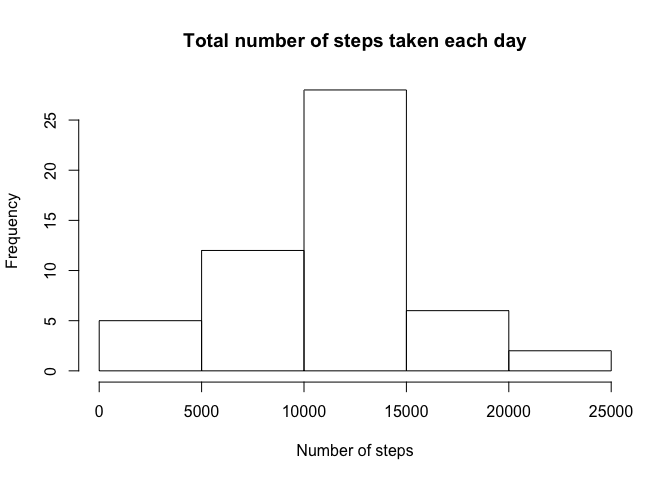
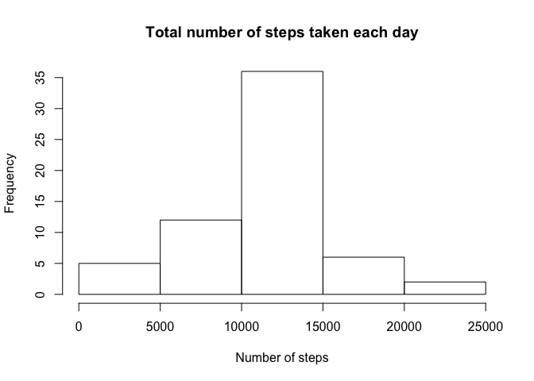
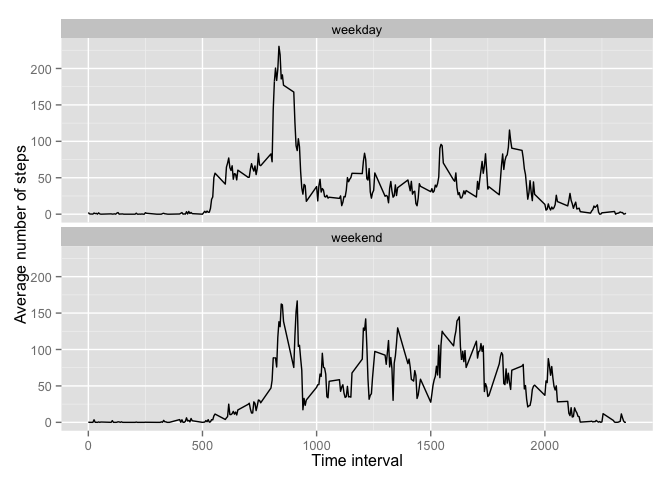

# Reproducible Research: Peer Assessment 1
## Loading and processing the data
Show any code that is needed to:

1. Load the data (i.e. read.csv())
2. Process/transform the data (if necessary) into a format suitable for your analysis

```r
#load data
unzip("activity.zip")
originalData <- read.csv("activity.csv")

#remove missing values
completeData <- originalData[complete.cases(originalData),]
```
## What is mean total number of steps taken per day?

For this part of the assignment, you can ignore the missing values in the dataset.


```r
#remove missing values
completeData <- originalData[complete.cases(originalData),]
```

1. Calculate the total number of steps taken per day

```r
#Sum up total number of steps taken by day
steps_by_day <- aggregate(steps ~ date, data=completeData, FUN=sum)
steps_by_day
```

```
##          date steps
## 1  2012-10-02   126
## 2  2012-10-03 11352
## 3  2012-10-04 12116
## 4  2012-10-05 13294
## 5  2012-10-06 15420
## 6  2012-10-07 11015
## 7  2012-10-09 12811
## 8  2012-10-10  9900
## 9  2012-10-11 10304
## 10 2012-10-12 17382
## 11 2012-10-13 12426
## 12 2012-10-14 15098
## 13 2012-10-15 10139
## 14 2012-10-16 15084
## 15 2012-10-17 13452
## 16 2012-10-18 10056
## 17 2012-10-19 11829
## 18 2012-10-20 10395
## 19 2012-10-21  8821
## 20 2012-10-22 13460
## 21 2012-10-23  8918
## 22 2012-10-24  8355
## 23 2012-10-25  2492
## 24 2012-10-26  6778
## 25 2012-10-27 10119
## 26 2012-10-28 11458
## 27 2012-10-29  5018
## 28 2012-10-30  9819
## 29 2012-10-31 15414
## 30 2012-11-02 10600
## 31 2012-11-03 10571
## 32 2012-11-05 10439
## 33 2012-11-06  8334
## 34 2012-11-07 12883
## 35 2012-11-08  3219
## 36 2012-11-11 12608
## 37 2012-11-12 10765
## 38 2012-11-13  7336
## 39 2012-11-15    41
## 40 2012-11-16  5441
## 41 2012-11-17 14339
## 42 2012-11-18 15110
## 43 2012-11-19  8841
## 44 2012-11-20  4472
## 45 2012-11-21 12787
## 46 2012-11-22 20427
## 47 2012-11-23 21194
## 48 2012-11-24 14478
## 49 2012-11-25 11834
## 50 2012-11-26 11162
## 51 2012-11-27 13646
## 52 2012-11-28 10183
## 53 2012-11-29  7047
```
2. Make a histogram of the total number of steps taken each day

```r
#Create histogram of the total number of steps taken each day
hist(steps_by_day$steps, main="Total number of steps taken each day", xlab="Number of steps")
```

 

3. Calculate and report the mean and median of the total number of steps taken per day

```r
#Calculate mean
mean(steps_by_day$steps)
```

```
## [1] 10766.19
```

```r
#Calculate median
median(steps_by_day$steps)
```

```
## [1] 10765
```

## What is the average daily activity pattern?

1. Make a time series plot (i.e. type = "l") of the 5-minute interval (x-axis) and the average number of steps taken, averaged across all days (y-axis)

```r
# Calculate average number of steps by time interval, averaged across all days
steps_by_interval <- aggregate(steps ~ interval, data=completeData, FUN=mean)

# Make time series plot
plot(steps_by_interval$interval, steps_by_interval$steps, type='l', main="Average number of steps by time interval", xlab="Time interval", ylab="Average number of steps")
```

 

2. Which 5-minute interval, on average across all the days in the dataset, contains the maximum number of steps?

```r
# Find 5-minute interval which on average, contains the maximum number of steps
steps_by_interval[which.max(steps_by_interval$steps),]
```

```
##     interval    steps
## 104      835 206.1698
```
## Imputing missing values

Note that there are a number of days/intervals where there are missing values (coded as NA). The presence of missing days may introduce bias into some calculations or summaries of the data.

1. Calculate and report the total number of missing values in the dataset (i.e. the total number of rows with NAs)


```r
# Calculate the total number of NA values
sum(is.na(originalData))
```

```
## [1] 2304
```

Devise a strategy for filling in all of the missing values in the dataset. The strategy does not need to be sophisticated. For example, you could use the mean/median for that day, or the mean for that 5-minute interval, etc.

2. Create a new dataset that is equal to the original dataset but with the missing data filled in.


```r
# Fill in missing data by using the mean for that 5-minute interval
imputedData <- originalData
for (i in 1:nrow(imputedData)) {
  if (is.na(imputedData$steps[i])) {
    interval_value <- imputedData$interval[i]
    step_value <- steps_by_interval[steps_by_interval$interval == interval_value,]
    imputedData$steps[i] <- step_value$steps
  }
}  
```
3. Make a histogram of the total number of steps taken each day and Calculate and report the mean and median total number of steps taken per day. Do these values differ from the estimates from the first part of the assignment? What is the impact of imputing missing data on the estimates of the total daily number of steps?

```r
# Sum up the total number of steps taken each day
imputedData_by_day <- aggregate(steps ~ date, data=imputedData, FUN=sum)

# Create histogram of the total number of steps taken each day
hist(imputedData_by_day$steps, main="Total number of steps taken each day", xlab="Number of steps")
```

 

```r
#Calculate mean
mean(imputedData_by_day$steps)
```

```
## [1] 10766.19
```

```r
#Calculate median
median(imputedData_by_day$steps)
```

```
## [1] 10766.19
```

The impact of imputing missing data on the mean and median is minimal

## Are there differences in activity patterns between weekdays and weekends?

For this part the weekdays() function may be of some help here. Use the dataset with the filled-in missing values for this part.

Create a new factor variable in the dataset with two levels – “weekday” and “weekend” indicating whether a given date is a weekday or weekend day.

1. Make a panel plot containing a time series plot (i.e. type = "l") of the 5-minute interval (x-axis) and the average number of steps taken, averaged across all weekday days or weekend days (y-axis). 


```r
# Determine day of the week for each date
imputedData['day_type'] <- weekdays(as.Date(imputedData$date))

# Create new factor variable with two levels - "weekday" and "weekend"
imputedData$day_type[imputedData$day_type %in% c("Saturday","Sunday")] <- "weekend"
imputedData$day_type[imputedData$day_type != "weekend"] <- "weekday"
imputedData$day_type<-as.factor(imputedData$day_type)

# Calculate average number of steps taken, averaged across all weekday or weekend days
imputedData_by_interval <- aggregate(steps~interval + day_type, data=imputedData, FUN=mean)

#create panel plot
library(ggplot2)
```

```
## Warning: package 'ggplot2' was built under R version 3.1.3
```

```r
qplot(interval, steps, data=imputedData_by_interval, type='l', geom=c("line"), xlab="Time interval", ylab="Average number of steps") + facet_wrap(~day_type, ncol=1)
```

 

